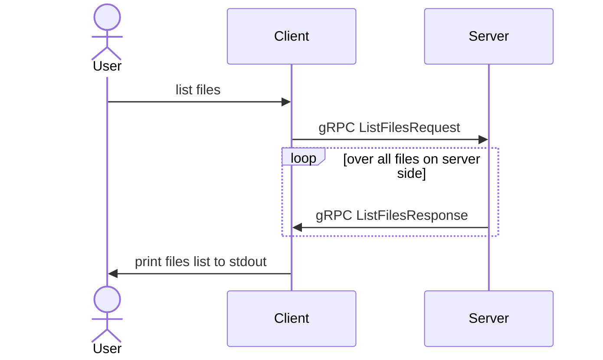
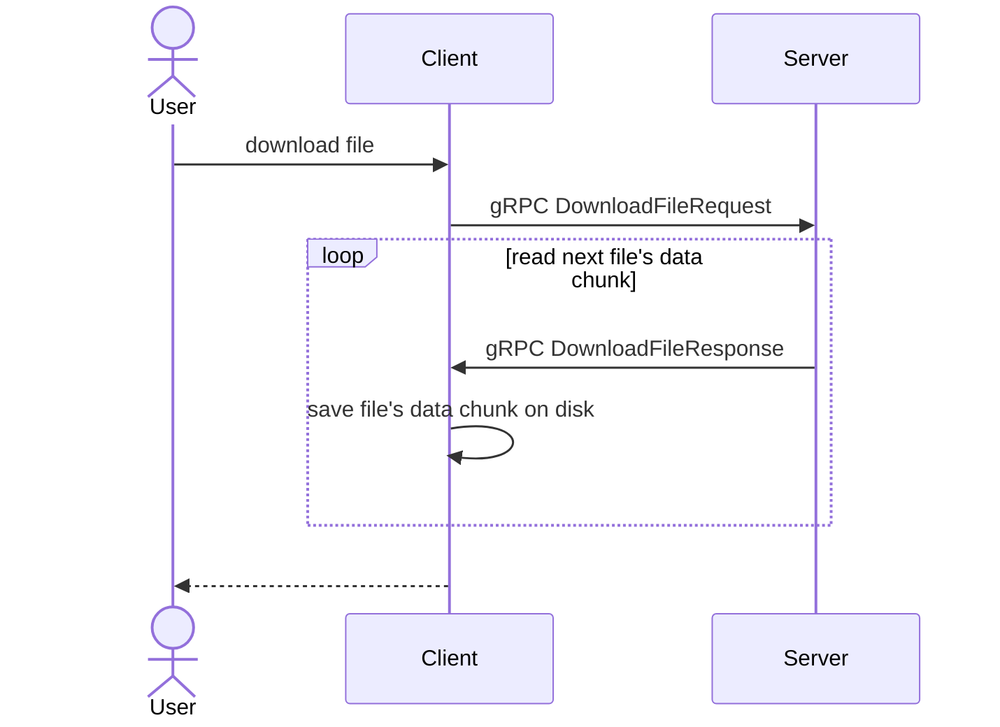
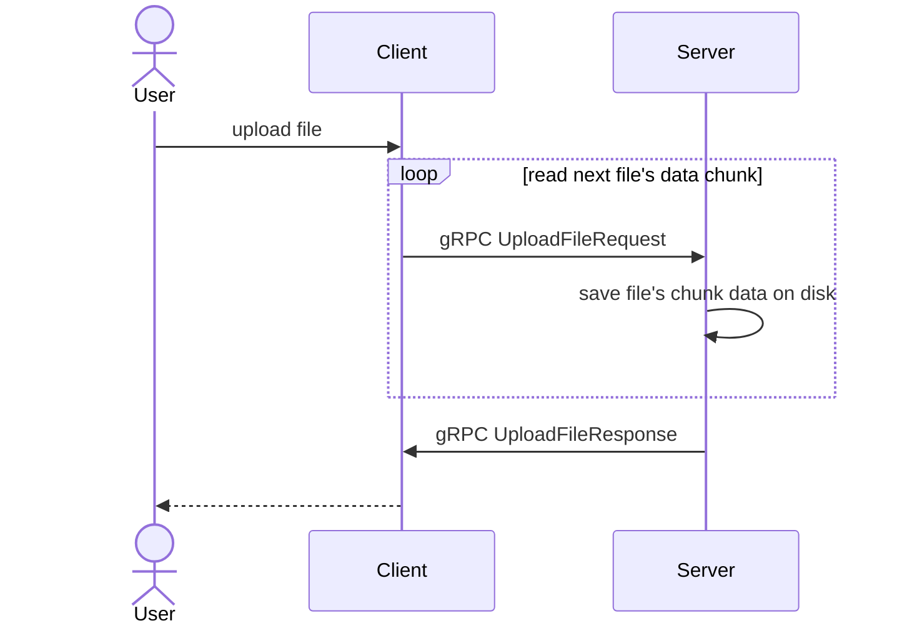

# grpc-file-transfer-rust

[](https://github.com/optimumood/grpc-file-transfer-rust/actions/workflows/rust.yml)
[](/LICENSE)

---

> gRPC file sharing server and client with mTLS (mutual Transport Layer Security), which provides communications security over a computer network.

## :scroll: Table of Contents
- [:thinking: About](#about)
- [:rocket: Getting Started](#getting-started)
    - [:shopping_cart: Prerequisites](#prerequisites)
    - [:hammer: Building binaries](#building-binaries)
    - [:electric_plug: Installing binaries](#installing-binaries)
    - [:heavy_check_mark: Running end-to-end tests](#running-e2e-tests)
    - [:turtle: Running end-to-end benchmarks](#running-e2e-benchmarks)
    - [:triangular_flag_on_post: Automated workflow](#automated-workflow)
    - [:desktop_computer: Usage](#usage)
- [:arrows_counterclockwise: Diagrams](#diagrams)
- [:building_construction: Technology stack](#technology-stack)

## :thinking: About <a name = "about"></a>
This project consists of gRPC server and client applications.
Server and client are authenticated by mTLS (mutual Transport Layer Security) cryptographic protocol using server and client certificates.
TLS encrypts data transfer between client and server so that external parties cannot spy on the communications.

Available features:
- list available files on server
- upload files to server
- download files from server

## :rocket: Getting started <a name = "getting-started"></a>
Read:
- how to build and install binaries
- how to run end-to-end tests and benchmarks
- about project's automated workflow
- about usage

### :shopping_cart: Prerequisites <a name = "prerequisites"></a>
If you want to build and run applications or tests, you need to install:
- [Rust toolchain](https://www.rust-lang.org)
- [Cargo-make](https://sagiegurari.github.io/cargo-make/) (Rust task runner and build tool)

### :hammer: Building binaries <a name = "building-binaries"></a>
#### debug mode
```shell
cargo make build
```

#### release mode
```shell
cargo make build-release
```

### :electric_plug: Installing binaries <a name = "installing-binaries"></a>
#### server
```shell
cargo make install-server
```
#### client
```shell
cargo make install-client
```

### :heavy_check_mark: Running end-to-end tests <a name = "running-e2e-tests"></a>

```shell
cargo make e2e-tests
```

### :turtle: Running end-to-end benchmarks <a name = "running-e2e-benchmarks"></a>
```shell
cargo make e2e-bench
```

### :triangular_flag_on_post: Automated workflow <a name = "automated-workflow"></a>
This project has GitHub Actions workflow, which:
- checks formatting
- checks lints
- checks if client and server binaries are building
- runs end-to-end tests
- runs end-to-end benchmarks

### :desktop_computer: Usage <a name="usage"></a>
First, install server and client applications using [Installing binaries](#installing-binaries) instruction.\
Now, you can use applications.\
Below are presented example commands.

- Server help command
```shell
$ server --help
Usage: server [OPTIONS] --directory <DIRECTORY> --cert <CERT> --key <KEY> --ca-cert <CA_CERT>

Options:
  -d, --directory <DIRECTORY>
  -H, --address <ADDRESS>      [default: 127.0.0.1]
  -p, --port <PORT>
  -v, --verbose <VERBOSE>      [default: info]
      --cert <CERT>
      --key <KEY>
      --ca-cert <CA_CERT>
  -i, --insecure
  -h, --help                   Print help information
  -V, --version                Print version information
```

- Client help command
```shell
$ client --help
Usage: client [OPTIONS] --port <PORT> --cert <CERT> --key <KEY> --ca-cert <CA_CERT> <COMMAND>

Commands:
  download
  upload
  list
  help      Print this message or the help of the given subcommand(s)

Options:
  -H, --address <ADDRESS>  [default: 127.0.0.1]
  -p, --port <PORT>
  -v, --verbose <VERBOSE>  [default: info]
      --cert <CERT>
      --key <KEY>
      --ca-cert <CA_CERT>
  -i, --insecure
  -h, --help               Print help information
  -V, --version            Print version information
```

- Run server on IPv6 localhost address with 50051 port and /tmp/server path as server directory:
  - mTLS secured
  ```shell
  $ server --directory /tmp/server -p 50051 --address ::1 --cert secrets/server-cert.pem --key secrets/server-key.pem --ca-cert secrets/ca-cert.pem
  ```
  - insecure
  ```shell
  $ server --directory /tmp/server -p 50051 --address ::1 --insecure
  ```

- List files command
  - mTLS secured
  ```shell
  $ client --port 50051 --address localhost --cert secrets/client-cert.pem --key secrets/client-key.pem --ca-cert secrets/ca-cert.pem list
  File name  Size
  abc        12B
  abc2       0B
  ```
  - insecure
  ```shell
  $ client --port 50051 --address localhost --insecure list
  File name  Size
  abc        12B
  abc2       0B
  ```

## :arrows_counterclockwise: Diagrams <a name = "diagrams"></a>
### High level sequence diagrams
- list files


- download file


- upload file


## :building_construction: Technology stack <a name = "technology-stack"></a>
- [Rust](https://www.rust-lang.org/) - Programming language
- [Tonic](https://github.com/hyperium/tonic) - Asynchronous Rust implementation of gRPC
- [PROST!](https://docs.rs/prost/latest/prost/) - Protocol Buffers implementation for the Rust Language
- [Tokio](https://tokio.rs/) - Asynchronous runtime for Rust
